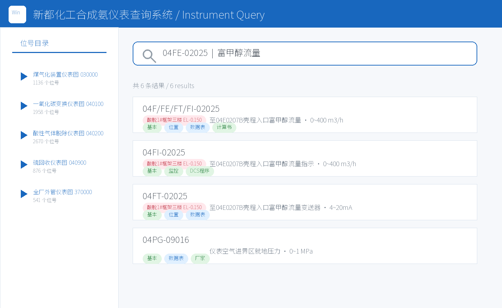
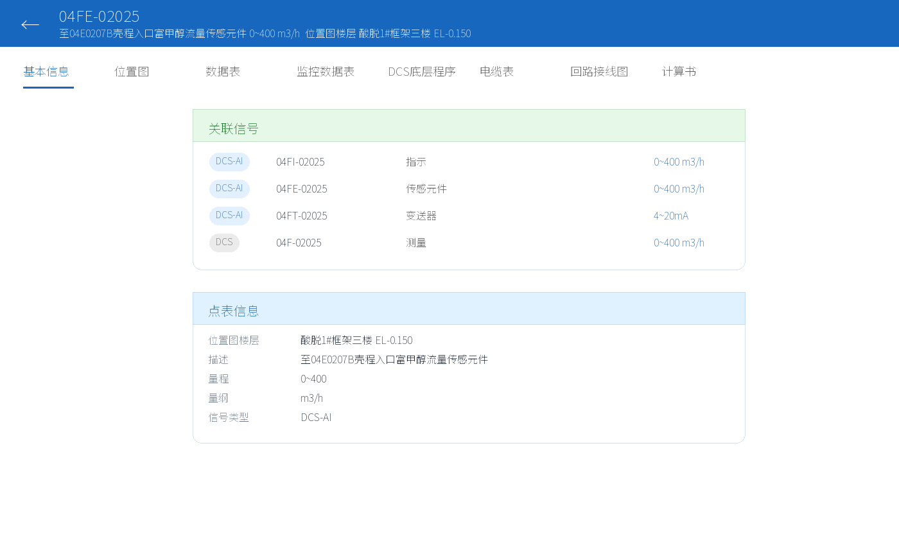
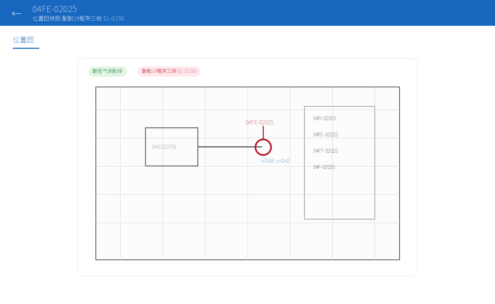
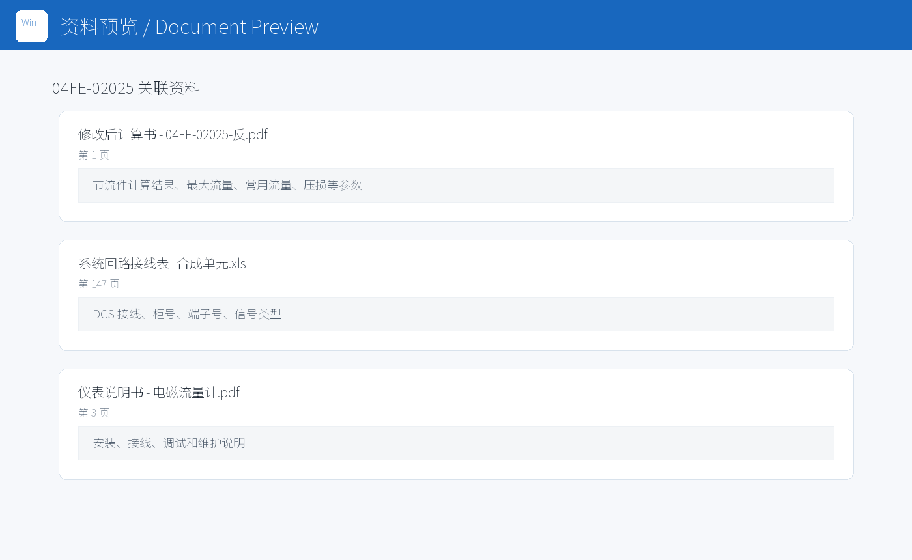

# Instrument Query System / 工业仪表资料查询系统

> Bilingual README. English follows each Chinese section.

这是一个基于 Cloudflare Workers 的工业仪表资料查询系统，用于把仪表位号、位置图、数据表、监控数据表、DCS 程序、回路接线图、流量计算书、厂家资料和说明书整合到一个可搜索、可预览、可维护的 Web 系统中。

This is a Cloudflare Workers based industrial instrument document query system. It consolidates instrument tags, position maps, datasheets, monitoring tables, DCS programs, loop wiring drawings, flow calculation sheets, vendor documents, and manuals into a searchable and previewable web application.

本公开仓库只包含应用代码和合成样本数据。真实生产图纸、生产 manifest、客户资料、Cloudflare Token、API Key、Cookie、密码和私钥均已排除。

This public repository contains application code and synthetic sample data only. Production drawings, production manifests, customer data, Cloudflare tokens, API keys, cookies, passwords, and private keys are intentionally excluded.

## 项目价值 / Why This Project Exists

工业项目中，同一个仪表位号通常分散在多类资料里：数据表、位置图、DCS 画面、监控数据表、接线图、厂家资料、计算书、说明书等。现场查询时，如果仍依赖文件夹和 PDF 手工翻找，效率低，并且容易遗漏。

In industrial projects, a single instrument tag usually appears across many document types: datasheets, position maps, DCS screens, monitoring tables, wiring drawings, vendor documents, calculation sheets, and manuals. Manually searching folders and PDFs is slow and error-prone.

本系统的目标是：输入一个位号、局部编号或中文描述，就能看到该仪表相关资料，并能在位置图上定位到对应点位。

The goal is simple: enter a tag number, partial number, or description, then view all related documents and locate the instrument on its position map.

## 核心功能 / Key Features

- 位号搜索和中文描述搜索 / Search by tag number or Chinese description
- 装置目录筛选 / Device-directory filtering
- 位号详情页按资料类型分组展示 / Instrument detail page grouped by document type
- 位置图预览，支持坐标点位和楼层标高显示 / Position-map preview with marker coordinates and floor or elevation labels
- 流量仪表 `F / FE / FT / FI` 同组查询 / Flow-instrument grouping for related `F / FE / FT / FI` tags
- 就地表 `PG / TG / LG` 与远传仪表分离，避免错误继承位置图 / Local gauges such as `PG / TG / LG` are kept separate from remote transmitter loops
- 说明书、计算书、厂家资料和渲染页面在线预览 / Online preview for manuals, calculation sheets, vendor documents, and rendered pages
- 使用预生成搜索索引，降低 Worker 冷启动查询压力 / Precomputed search index to avoid expensive Worker cold-start scans

## 图文介绍 / Visual Walkthrough

下面图片均为合成界面示意图，用于说明系统交互和资料组织方式，不包含真实生产图纸或客户数据。示例中的装置名、位号格式和中文描述采用真实项目风格，便于理解实际使用场景。

The following images are synthetic UI illustrations. They demonstrate the interaction model and document organization without exposing production data. Device names, tag formats, and Chinese descriptions use realistic project-style labels so the screenshots remain readable.

### 1. 搜索与装置目录 / Search and Device Directory

用户可以按位号、局部编号或中文描述搜索。结果卡片显示位号、描述、量程、楼层和已有资料类型。

Users can search by tag number, partial number, or Chinese description. Result cards show the tag, description, range, floor, and available document types.



### 2. 位号详情 / Instrument Detail

详情页把同一回路的关联信号、点表参数和资料入口集中到一个页面。流量仪表支持 `F / FE / FT / FI` 同组展示；就地表 `PG / TG / LG` 不会错误继承远传仪表位置。

The detail view combines related loop signals, tag metadata, and document tabs. Flow tags such as `F / FE / FT / FI` are grouped for lookup, while local gauges such as `PG / TG / LG` do not inherit remote transmitter locations.



### 3. 位置图定点 / Position Map Marker

位置图资料保存图纸页、楼层标高和归一化坐标。前端根据 `x/y` 坐标在图上显示定位点，并在标题和位置图卡片中显示楼层文字。

Position-map records store the drawing page, floor/elevation, and normalized coordinates. The frontend renders the marker using the stored `x/y` coordinates and displays the floor label in both the title and the map card.



### 4. 多类型资料预览 / Document Preview

同一个位号可以挂接数据表、监控数据表、DCS 程序、回路接线图、流量计算书、厂家资料和说明书。系统统一把这些资料渲染成可预览页面。

The same tag can link to datasheets, monitoring tables, DCS programs, loop wiring drawings, flow calculation sheets, vendor documents, and manuals. The system renders them into previewable pages.



## 系统架构 / Architecture

```text
Browser / Mobile Browser
        |
Cloudflare Worker
        |
        +-- Cloudflare KV
        |      manifest
        |      tag_meta
        |      tag_list
        |      search_index
        |
        +-- Cloudflare R2
               rendered document pages
               manual previews
```

前端是一个由 Worker 返回的单页应用。后端 API 从 KV 读取 manifest 和索引数据，从 R2 读取渲染后的图片文件。

The frontend is a single-page application served by the Worker. Backend APIs read metadata from KV and rendered page images from R2.

## 数据模型 / Data Model

核心 KV 数据包括：

Core KV values:

- `manifest`: 位号到资料引用的主索引 / main tag-to-document map
- `tag_meta`: 位号描述、量程、量纲、信号类型等基础信息 / tag descriptions, ranges, units, and signal metadata
- `tag_list`: 装置目录与轻量位号列表 / device tree and lightweight tag list
- `search_index`: 预生成搜索索引 / precomputed search index

支持的资料类型：

Supported document types:

- `datasheet`
- `location`
- `flowcalc`
- `vendor`
- `monitoring`
- `dcs`
- `reference`
- `jbxx`
- `gds`

## 仓库结构 / Repository Layout

- `src/index.js`: Cloudflare Worker 入口和 API 路由 / Worker entrypoint and API routes
- `src/webapp.js`: 前端单页应用 / frontend SPA
- `src/pressure_gauge_vendor_map.js`: 压力表厂家资料映射 / pressure-gauge vendor mapping
- `sample-data/`: 合成样本数据 / synthetic sample data
- `docs/`: 项目文档、架构记录和 README 图片 / project documentation, architecture notes, and README images
- `tasks/`: 当前任务和工作流记录 / task and workflow notes
- `deploy/`: 部署说明和运行手册目录 / deployment notes and runbook scaffolding
- `scripts/`: 示例数据、文档图片和发布辅助脚本 / sample-data, documentation-image, and release helper scripts

## 本地开发 / Local Development

安装 Wrangler：

Install Wrangler:

```powershell
npm install -g wrangler
```

复制示例配置：

Copy the example configuration:

```powershell
Copy-Item wrangler.example.toml wrangler.toml
```

把 `wrangler.toml` 中的 KV、R2、域名等占位值替换为自己的 Cloudflare 资源。

Replace placeholder KV, R2, and domain values in `wrangler.toml` with your own Cloudflare resources.

启动本地 Worker：

Start the local Worker:

```powershell
wrangler dev
```

## 生产同步流程 / Production Sync Workflow

真实生产系统使用生成后的 JSON 数据和 Cloudflare 资源。本公开仓库不包含生产数据。

The production system uses generated JSON metadata and Cloudflare resources. This public repository does not include production data.

典型流程：

Typical workflow:

```powershell
python .\sync_production_kv.py --upload
wrangler deploy
```

使用前必须检查：

Before using the script, review:

- manifest 文件路径 / manifest file paths
- KV namespace ID
- Cloudflare 认证状态 / Cloudflare authentication
- R2 bucket 名称 / R2 bucket name
- 环境变量和密钥 / environment variables and secrets

## 安全说明 / Security Notes

不要提交以下内容：

Do not commit:

- `.env`
- `.r2_credentials`
- `.wrangler`
- 真实 `manifest` / `tag_meta` / `search_index`
- 上传日志和上传清单 / upload logs and upload lists
- 渲染后的真实图纸 / rendered production drawings
- API Key、Token、Cookie、密码、私钥 / API keys, tokens, cookies, passwords, private keys

本仓库中的样本均为合成数据，不是完整生产数据导出。

The samples in this repository are synthetic and are not a production data export.

