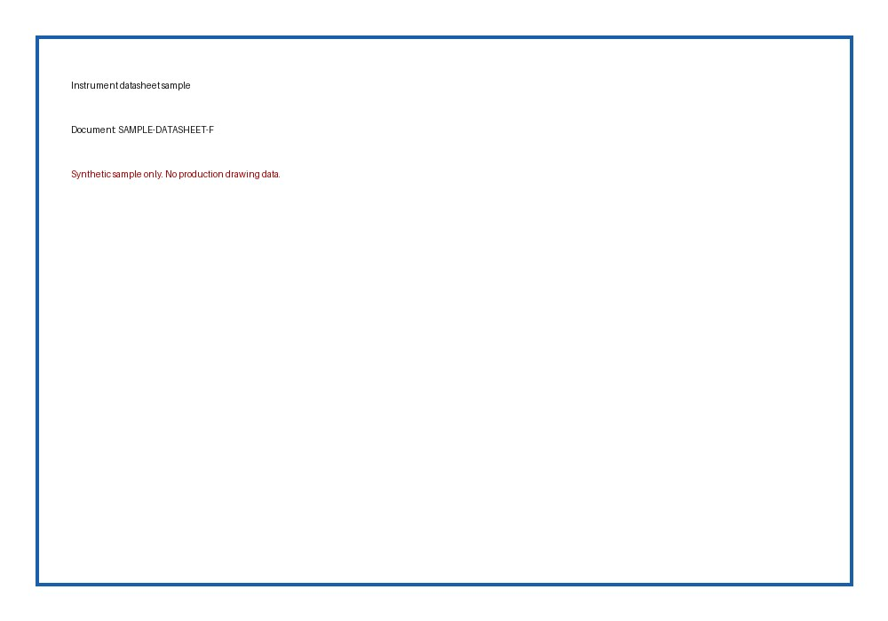
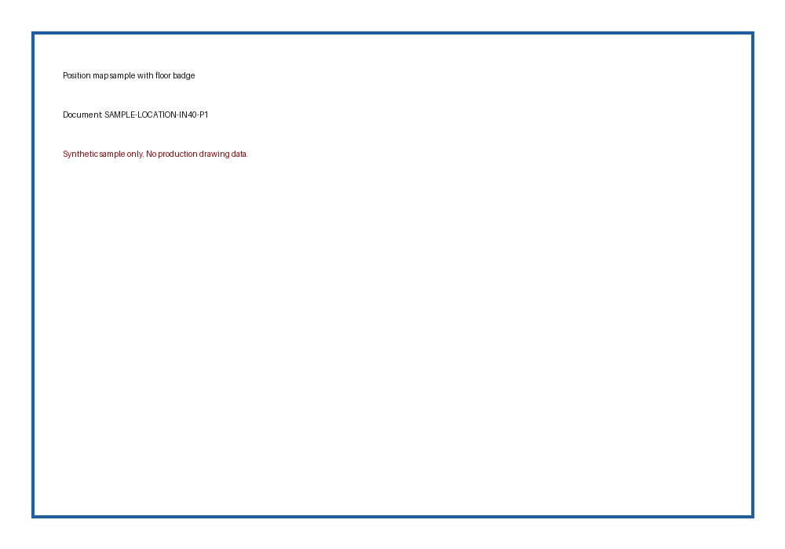
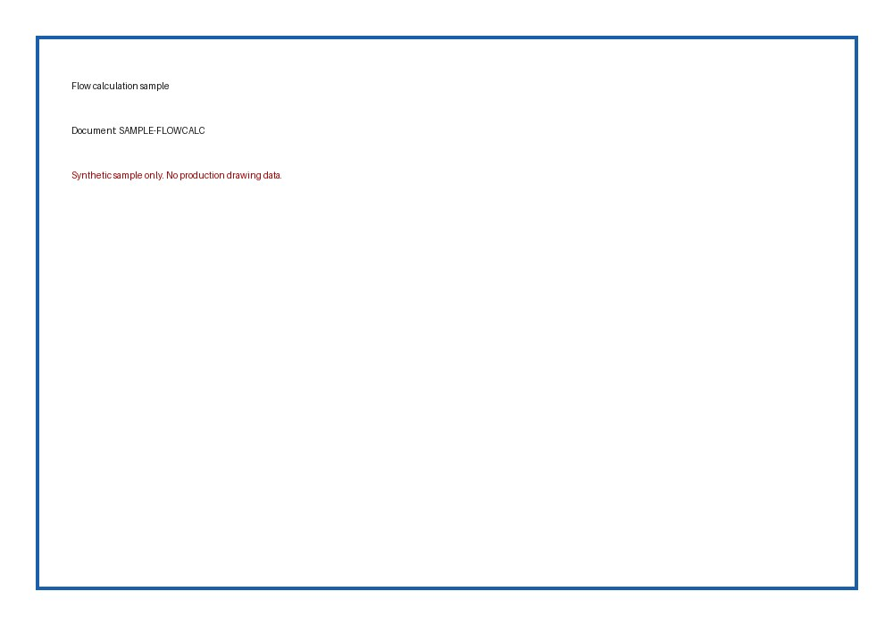
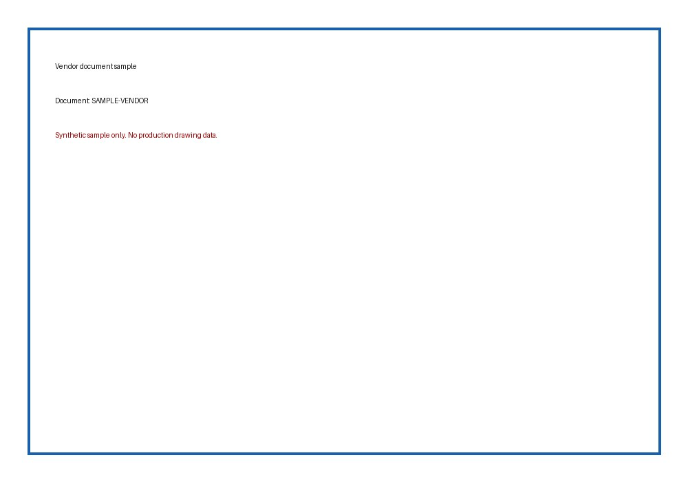

# Instrument Query System / 工业仪表资料查询系统

> Bilingual README. English follows each Chinese section.

这是一个基于 Cloudflare Workers 的工业仪表资料查询系统，用于把仪表位号、位置图、数据表、监控数据表、DCS 程序、回路接线图、流量计算书、厂家资料和说明书整合到一个可搜索、可预览、可维护的 Web 系统中。

This is a Cloudflare Workers based industrial instrument document query system. It consolidates instrument tags, position maps, datasheets, monitoring tables, DCS programs, loop wiring drawings, flow calculation sheets, vendor documents, and manuals into a searchable and previewable web application.

本公开仓库只包含应用代码和合成样本数据。真实生产图纸、生产 manifest、客户资料、Cloudflare Token、API Key、Cookie、密码和私钥均已排除。

This public repository contains application code and synthetic sample data only. Production drawings, production manifests, customer data, Cloudflare tokens, API keys, cookies, passwords, and private keys are intentionally excluded.

## 项目价值 / Why This Project Exists

工业项目中，同一个仪表位号通常分散在多类资料里：数据表、位置图、DCS 画面、监控数据表、接线图、厂家资料、计算书、说明书等。现场查询时，如果仍靠文件夹和 PDF 手工翻找，效率低，且容易遗漏。

In industrial projects, a single instrument tag usually appears across many document types: datasheets, position maps, DCS screens, monitoring tables, wiring drawings, vendor documents, calculation sheets, and manuals. Manually searching folders and PDFs is slow and error-prone.

本系统的目标是：输入一个位号或描述，就能看到该仪表相关资料，并在位置图上定位到对应点位。

The goal is simple: enter a tag number or description, then view all related documents and locate the instrument on its position map.

## 核心功能 / Key Features

- 位号搜索和描述搜索
- Search by tag number or description

- 位号详情页，按资料类型分组展示
- Instrument detail page grouped by document type

- 位置图预览，支持坐标点位和楼层/标高显示
- Position-map preview with marker coordinates and floor/elevation labels

- 流量仪表 `F / FE / FT / FI` 同组查询
- Flow-instrument grouping for related `F / FE / FT / FI` tags

- 就地表 `PG / TG / LG` 与远传仪表分离，避免错误继承位置图
- Local gauges such as `PG / TG / LG` are kept separate from remote transmitter loops

- 说明书和渲染页面在线预览
- Manual and rendered document preview

- 使用预生成搜索索引，降低 Worker 冷启动查询压力
- Precomputed search index to avoid expensive Worker cold-start scans

## 图文介绍 / Visual Walkthrough

下面图片均为合成样本，用于说明系统支持的资料类型，不包含真实生产数据。

The following images are synthetic samples. They demonstrate supported document types without exposing production data.

### 1. 数据表 / Datasheet

仪表数据表用于查看量程、量纲、信号类型、开方、报警等基础参数。

Datasheets provide range, unit, signal type, square-root extraction, alarm settings, and other core parameters.



### 2. 位置图 / Position Map

位置图用于定位仪表所在图纸、楼层/标高以及图中坐标。生产系统中会把 `x/y` 坐标写入 manifest，并在前端显示定位点。

Position maps locate the instrument on the drawing, including floor/elevation and normalized `x/y` coordinates stored in the manifest.



### 3. 流量计算书 / Flow Calculation Sheet

流量计计算书作为 `flowcalc` 类型资料挂到位号下。系统支持保留旧计算书，同时追加修改版计算书。

Flow calculation sheets are attached as `flowcalc` documents. The system can keep original calculation sheets while adding revised versions.



### 4. DCS 与监控资料 / DCS and Monitoring Documents

DCS 程序、监控数据表、IO 表等可作为独立 tab 展示，便于从同一个位号入口追踪控制系统资料。

DCS programs, monitoring tables, and IO tables are shown as separate tabs so control-system documents can be reached from the same tag entry.


### 5. 回路接线与厂家资料 / Loop Wiring and Vendor Documents

回路接线图、厂家资料、安装尺寸图和说明书等都通过统一文档引用模型进入位号详情页。

Loop wiring drawings, vendor documents, installation drawings, and manuals all use the same document-reference model in the instrument detail view.




## 系统架构 / Architecture

```text
Browser / Mobile Browser
        |
Cloudflare Worker
        |
        +-- Cloudflare KV
        |      manifest
        |      tag_meta
        |      tag_list
        |      search_index
        |
        +-- Cloudflare R2
               rendered document pages
               manual previews
```

前端是一个由 Worker 返回的单页应用。后端 API 从 KV 读取 manifest 和索引数据，从 R2 读取渲染后的图片文件。

The frontend is a single-page application served by the Worker. Backend APIs read metadata from KV and rendered page images from R2.

## 数据模型 / Data Model

核心 KV 数据包括：

Core KV values:

- `manifest`: 位号到资料引用的主索引 / main tag-to-document map
- `tag_meta`: 位号描述、量程、量纲、信号信息 / tag descriptions, ranges, units, and signal metadata
- `tag_list`: 装置目录与轻量位号列表 / device tree and lightweight tag list
- `search_index`: 预生成搜索索引 / precomputed search index

支持的资料类型：

Supported document types:

- `datasheet`
- `location`
- `flowcalc`
- `vendor`
- `monitoring`
- `dcs`
- `reference`
- `jbxx`
- `gds`

## 仓库结构 / Repository Layout

- `src/index.js`: Cloudflare Worker 入口和 API 路由 / Worker entrypoint and API routes
- `src/webapp.js`: 前端单页应用 / frontend SPA
- `src/pressure_gauge_vendor_map.js`: 压力表厂家资料映射 / pressure-gauge vendor mapping
- `sample-data/`: 合成样本数据 / synthetic sample data
- `docs/`: 项目文档和架构记录 / project documentation and architecture notes
- `tasks/`: 当前任务和工作流记录 / task and workflow notes
- `deploy/`: 部署说明和运行手册目录 / deployment notes and runbook scaffolding
- `*.py`: 数据导入、渲染、manifest 更新和同步脚本 / import, rendering, manifest update, and sync utilities

## 本地开发 / Local Development

安装 Wrangler：

Install Wrangler:

```powershell
npm install -g wrangler
```

复制示例配置：

Copy the example configuration:

```powershell
Copy-Item wrangler.example.toml wrangler.toml
```

把 `wrangler.toml` 中的 KV、R2、域名等占位值替换为自己的 Cloudflare 资源。

Replace placeholder KV, R2, and domain values in `wrangler.toml` with your own Cloudflare resources.

启动本地 Worker：

Start the local Worker:

```powershell
wrangler dev
```

## 生产同步流程 / Production Sync Workflow

真实生产系统使用生成后的 JSON 数据和 Cloudflare 资源。本公开仓库不包含生产数据。

The production system uses generated JSON metadata and Cloudflare resources. This public repository does not include production data.

典型流程：

Typical workflow:

```powershell
python .\sync_production_kv.py --upload
wrangler deploy
```

使用前必须检查：

Before using the script, review:

- manifest 文件路径 / manifest file paths
- KV namespace ID
- Cloudflare 认证状态 / Cloudflare authentication
- R2 bucket 名称 / R2 bucket name
- 环境变量和密钥 / environment variables and secrets

## 安全说明 / Security Notes

不要提交以下内容：

Do not commit:

- `.env`
- `.r2_credentials`
- `.wrangler`
- 真实 `manifest` / `tag_meta` / `search_index`
- 上传日志和上传清单 / upload logs and upload lists
- 渲染后的真实图纸 / rendered production drawings
- API Key、Token、Cookie、密码、私钥 / API keys, tokens, cookies, passwords, private keys

本仓库中的样本均为合成数据，不是完整生产数据导出。

The samples in this repository are synthetic and are not a production data export.
